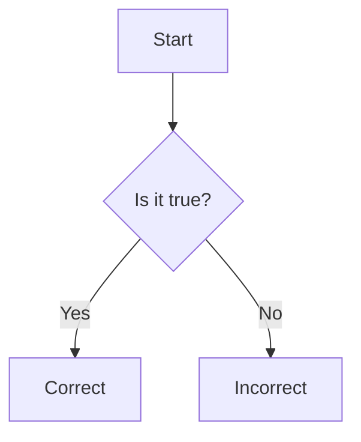
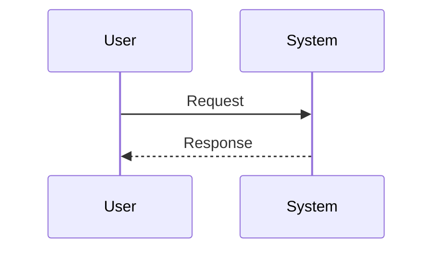
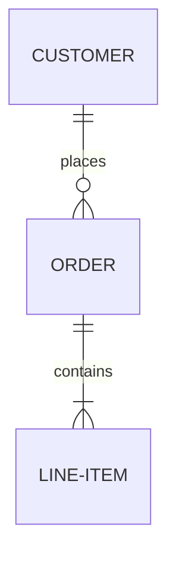
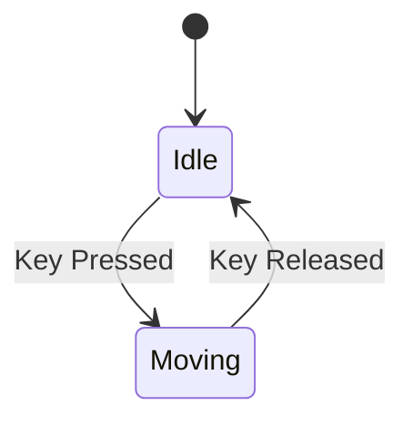

# Mermaid.js Quick Reference

## Flowchart

```mermaid
graph TD
    A[Start] --> B{Is it true?}
    B -- Yes --> C[Correct]
    B -- No --> D[Incorrect]
```

## Sequence Diagram

```mermaid
sequenceDiagram
    participant User
    participant System
    User->>System: Request
    System-->>User: Response
```

## Entity Relationship (ERD)

```mermaid
erDiagram
    CUSTOMER ||--o{ ORDER : places
    ORDER ||--|{ LINE-ITEM : contains
```

## State Diagram

```mermaid
stateDiagram-v2
    [*] --> Idle
    Idle --> Moving : Key Pressed
    Moving --> Idle : Key Released
```
